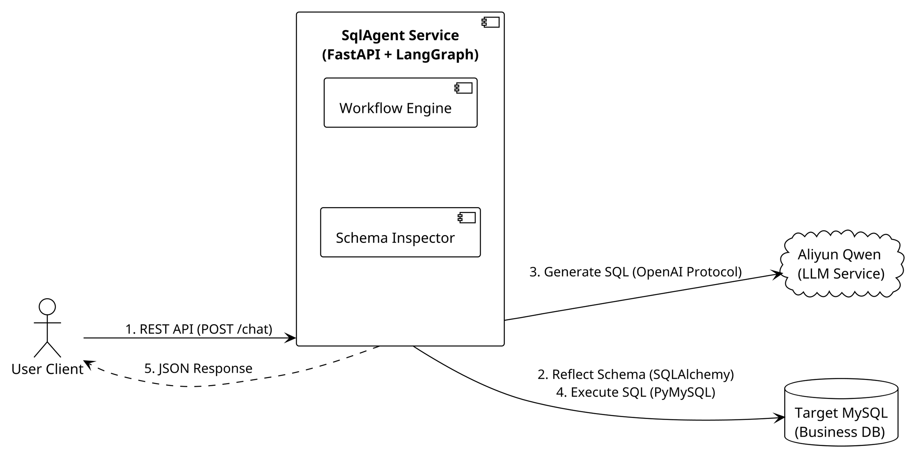
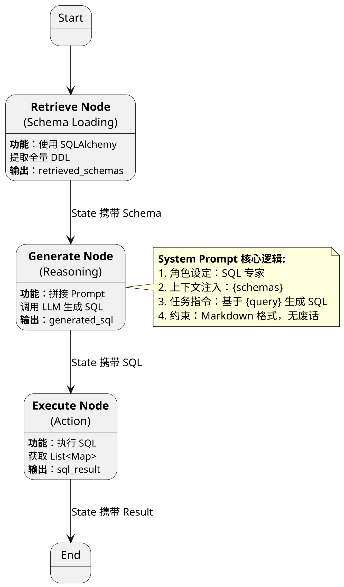
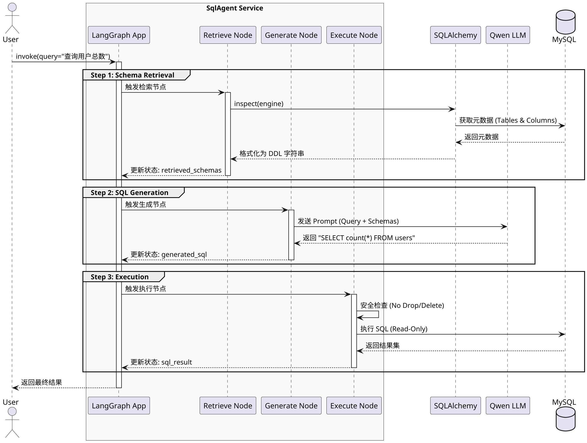

## 1. 设计目标 (Design Goal)

本项目（SqlAgent）旨在构建一个基于大模型（LLM）的 Text-to-SQL 智能体。
**V1 版本 (MVP)** 的核心目标是验证基于 **Python 异步生态** 的线性链路可行性，重点跑通数据流，为后续引入 RAG 和自愈合机制打下基础。

* **核心功能**：实现“自然语言 -> Schema 提取 -> SQL 生成 -> 数据库执行 -> 返回结果”的端到端单轮对话。
* **架构验证**：验证 SQLAlchemy 的 Schema 动态反射能力以及 LangGraph 的基础状态流转机制。
* **非功能目标**：确保系统具备基础的安全性（只读账号/Limit行数限制）和高并发下的异步 I/O 能力。

## 2. 系统上下文 (System Context)

本系统作为独立的 Agent 服务存在，向下连接业务数据库（MySQL），向外调用大模型服务（Aliyun Qwen）。系统边界清晰，通过 RESTful API 与外部客户端交互。

<figure id="liucheng" class="fig">

<figcaption>图：整体流程图</figcaption>
</figure>



## 3. 核心状态定义 (Agent State Definition)

在 LangGraph 架构中，**State (状态)** 是所有节点共享的内存上下文，承载了 Agent 在思考过程中的所有信息。V1 版本定义了如下 TypedDict 结构：

| 字段名 (Field) | 类型 (Type) | 描述 (Description) | 更新来源节点 |
| --- | --- | --- | --- |
| `user_query` | `str` | 用户的原始自然语言问题 | Input |
| `retrieved_schemas` | `str` | 从数据库实时提取的全量 DDL 文本 | Retrieve Node |
| `generated_sql` | `str` | LLM 生成并经过清洗的 SQL 语句 (已去除 Markdown 标记) | Generate Node |
| `sql_result` | `List[Dict]` | SQL 执行后的结果集 (JSON Serializable) | Execute Node |

## 4. 图结构拓扑 (Graph Topology)

V1 版本采用 **DAG (有向无环图)** 结构，数据单向流动。虽然 LangGraph 支持循环，但在 MVP 阶段我们优先保证线性链路的稳定性。

<figure id="tujiegou" class="fig">

<figcaption>图：图结构拓扑图</figcaption>
</figure>

**节点详细说明：**

1. **Retrieve Node (Schema Loading)**:
* **输入**: `user_query`
* **逻辑**: 使用 `SQLAlchemy Inspector` 动态扫描数据库，获取所有表的 CREATE TABLE 语句。
* **输出**: 更新 `retrieved_schemas`。


2. **Generate Node (Reasoning)**:
* **输入**: `user_query`, `retrieved_schemas`
* **逻辑**: 组装 System Prompt，设定“SQL 专家”人设，将 Schema 注入上下文，调用 Qwen 模型生成 SQL。
* **输出**: 更新 `generated_sql`。


3. **Execute Node (Action)**:
* **输入**: `generated_sql`
* **逻辑**: 进行静态安全检查（禁止 DROP/DELETE），强制添加 `LIMIT` 限制，执行 SQL。
* **输出**: 更新 `sql_result`。



## 5. 运行时序 (Runtime Sequence)

以下时序图展示了一次用户请求在系统内部各组件间的完整调用流转：

<figure id="yunxingshi" class="fig">

<figcaption>图：运行时序图</figcaption>
</figure>



## 6. 关键技术决策 (Key Decisions)

### 6.1 异步架构 (AsyncIO vs Threading)

* **决策**：全链路采用 Python `async/await` (FastAPI + Async SQLAlchemy)。
* **理由**：Agent 任务属于典型的 **I/O 密集型** 场景（大部分时间在等待数据库返回或 LLM 生成）。相比于 Java 的线程池模型，Python 的协程机制能在单核上支撑更高的并发连接数，且资源消耗更低。

### 6.2 Schema 提取策略

* **决策**：V1 版本使用 `SQLAlchemy Inspector` 进行**即时反射 (Runtime Reflection)**。
* **理由**：
1. **开发效率**：利用 ORM 生态避免了手写复杂的 JDBC 元数据解析代码。
2. **一致性**：在 MVP 阶段，实时提取能保证 Schema 绝对最新，避免缓存失效导致生成的 SQL 字段不存在。


### 6.3 LLM 交互协议

* **决策**：使用 `LangChain` 的 `ChatOpenAI` 接口适配 Aliyun Qwen。
* **理由**：Qwen 提供了兼容 OpenAI 协议的 API。使用标准接口可以最大化代码的通用性，实现 LLM 后端的无缝切换（如切换至 DeepSeek 或 GPT-4），符合"依赖倒置"原则。

## 7. 接口定义 (API Interface)

V1 版本仅暴露单一同步接口，供前端调用。

**POST /api/v1/chat**

**Request:**

```json
{
  "query": "最近一个月订单量最高的 5 个用户是谁？",
  "model": "qwen-plus"
}

```

**Response:**

```json
{
  "success": true,
  "data": {
    "sql": "SELECT user_id, count(*) as cnt FROM orders WHERE created_at > ... GROUP BY user_id ORDER BY cnt DESC LIMIT 5",
    "result": [
      {"user_id": 101, "cnt": 42},
      {"user_id": 205, "cnt": 38}
    ]
  }
}
```

## 8. 后续规划 (Roadmap)

当前 V1 版本存在以下局限，将在后续版本中迭代：

* **Token 限制**：全量 Schema 注入会导致 Context Window 溢出 -> **V2 计划引入混合检索 (RAG)**。
* **容错性**：SQL 生成错误直接导致任务失败 -> **V3 计划引入 Self-Correction 循环**。
* **安全性**：依赖代码层的正则检查 -> **V3 计划引入 SQL AST 深度解析**。

## 9. V1 落地情况 (Implementation Status)

*(Updated on 2025-12-21)*

V1 版本已完成代码开发与接口联调，各项功能符合设计预期。核心模块已通过单元测试与集成测试。

### 9.1 模块实现详情
* **Infrastructure (`app.db`)**: 实现了基于 `SQLAlchemy Inspector` 的全量 Schema 实时提取，支持自动过滤非业务字段。
* **Agent Core (`app.agent`)**:
    * **Retrieve**: 成功连接本地 MySQL，提取耗时 < 50ms (基于 Chinook 数据集)。
    * **Generate**: 接入 Aliyun Qwen-Plus，Prompt 已固化在 `app.core.prompts`，支持 Markdown 格式清洗。
    * **Execute**: 实现了只读权限校验（Regex Blacklist）与自动 try-catch 容错，防止 Agent 崩溃。
* **Service Layer (`main.py`)**: 基于 FastAPI 实现了异步 REST 接口，支持 Swagger 文档自动生成。

### 9.2 API 接口定义 (API Reference)

V1 版本对外暴露唯一的对话接口，采用标准 JSON 格式交互。

#### 9.2.1 智能对话接口

* **URL**: `/api/v1/chat`
* **Method**: `POST`
* **Content-Type**: `application/json`

**请求参数 (Request):**

| 参数名 | 类型 | 必选 | 描述 | 示例 |
| :--- | :--- | :--- | :--- | :--- |
| `query` | string | 是 | 用户自然语言问题 | "查询前3个专辑名称" |
| `model` | string | 否 | 指定底层模型 (预留) | "qwen-plus" |

```json
{
  "query": "查询前3个专辑的名称",
  "model": "qwen-plus"
}

```

**响应参数 (Response):**

| 参数名 | 类型 | 描述 |
| --- | --- | --- |
| `success` | bool | 请求是否成功 |
| `data` | object | 成功时返回的数据载荷 |
| `data.sql` | string | Agent 生成的 SQL 语句 |
| `data.result` | array | 数据库查询结果集 |
| `error` | string | 失败时的错误信息 |

```json
{
  "success": true,
  "data": {
    "sql": "SELECT Title FROM Album LIMIT 3",
    "result": [
      { "Title": "For Those About To Rock We Salute You" },
      { "Title": "Balls to the Wall" },
      { "Title": "Restless and Wild" }
    ]
  },
  "error": null
}

```

### 9.3 已知局限与 V2 规划 (Limitations & Roadmap)

当前 V1 版本存在以下物理限制，将在 V2 版本中通过引入 **RAG (检索增强生成)** 解决：

1. **Context Window 瓶颈**: 目前采用全量 Schema 注入。当表数量超过 50 张或字段过多时，会导致 Prompt 长度超过 LLM 上下文限制，甚至触发拒绝服务。
2. **缺乏语义理解**: 仅依赖 LLM 自身的常识进行字段匹配。对于缩写、黑话（如 "GMV" 对应 `gross_merchandise_volume`）识别能力较弱。
3. **无自愈能力**: 遇到 SQL 语法错误或逻辑错误时，Agent 无法通过错误日志自动重写 SQL。

**Next Step**: V2 版本将引入向量数据库 (Qdrant) 实现 Schema 的混合检索 (Hybrid Search)。
