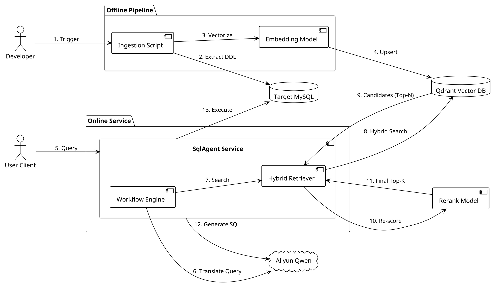
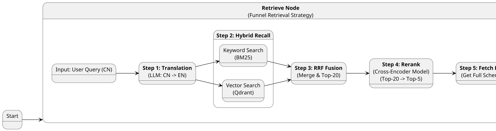
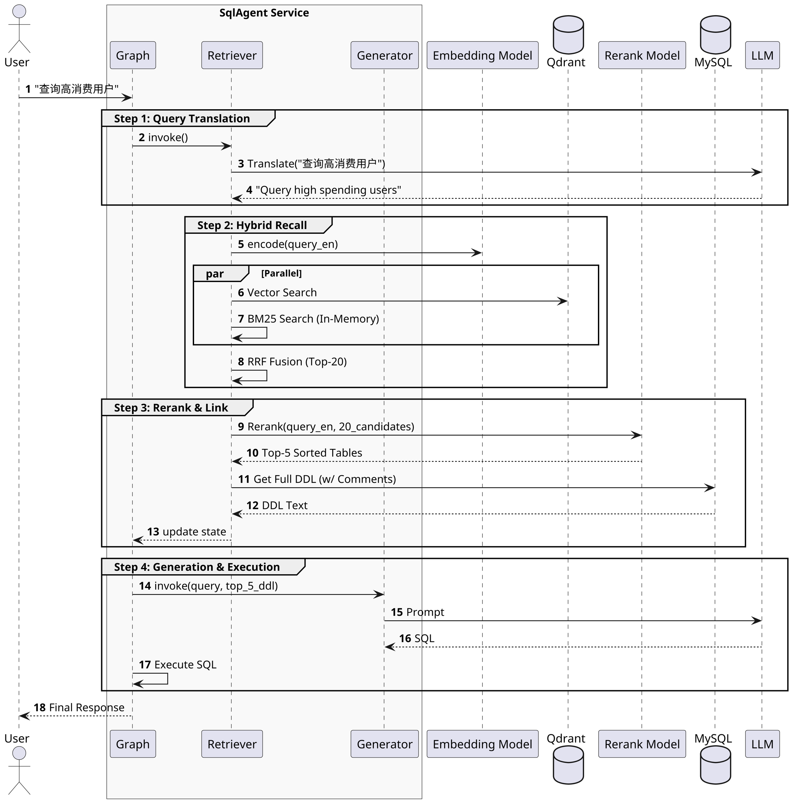

## 1. 设计目标 (Design Goal)

在 V1 版本跑通线性链路的基础上，**V2 版本 (Hybrid RAG)** 旨在解决大规模数据库场景下的 **Context Window 瓶颈**、**语义理解不足** 以及 **跨语言检索** 问题。

* **核心功能**：构建 **"Translation -> Hybrid Search -> Rerank"** 的高精度检索漏斗。
* **架构验证**：验证 Qdrant (Vector) + BM25 (Keyword) + DashScope Rerank 组合在 Text-to-SQL 场景下的召回效果。
* **非功能目标**：在 500+ 张表规模下，实现 Recall@5 > 95%，支持中文自然语言查询英文表结构。

## 2. 系统上下文 (System Context)

V2 版本引入了 **知识入库 (Ingestion)** 离线流程，并在线上服务中集成了 **Embedding Model** 和 **Rerank Model** 两个外部原子能力。

<figure id="liucheng_v2" class="fig">

<figcaption>图：V2 混合检索流程图</figcaption>
</figure>



## 3. 核心状态定义 (Agent State Definition)

V2 State 扩展了检索相关的元数据字段。

| 字段名 (Field) | 类型 (Type) | 描述 (Description) | 更新来源节点 |
| --- | --- | --- | --- |
| `user_query` | `str` | 用户的原始问题 | Input |
| `retrieved_schemas` | `str` | **筛选后的** Top-K 完整 DDL 文本 (含注释/外键) | Retrieve Node |
| `retrieved_table_names` | `List[str]` | 最终召回的表名列表 | Retrieve Node |
| `generated_sql` | `str` | LLM 生成的 SQL | Generate Node |
| `sql_result` | `List[Dict]` | SQL 执行结果 | Execute Node |

## 4. 图结构拓扑 (Graph Topology)

V2 版本的核心逻辑集中在 **Retrieve Node** 的内部升级。我们采用了 **漏斗型 (Funnel)** 检索策略。

<figure id="tujiegou_v2" class="fig">

<figcaption>图：V2 检索逻辑详情</figcaption>
</figure>

**节点详细说明 (Retrieve Node Logic)：**

1. **Query Translation**: 调用 LLM 将用户的中文查询转换为英文（对齐 Chinook 数据库的英文 Schema）。
2. **Parallel Recall (并行召回)**:
* **Vector**: 语义匹配，解决同义词问题（如 "Revenue" vs "Total"）。
* **BM25**: 关键词匹配，解决专有名词问题（如 "InvoiceId"）。


3. **RRF Fusion**: 倒数排名融合，初步筛选 Top-N (e.g., 20)。
4. **Rerank (重排序)**: 使用 Cross-Encoder 模型（DashScope qweb3-rerank）进行精排，输出最终 Top-K (e.g., 5)。
5. **Schema Linking**: 回源数据库获取这 5 张表的最新 DDL。



## 5. 运行时序 (Runtime Sequence)

V2 引入了翻译和重排序步骤，增加了外部交互。

<figure id="yunxingshi" class="fig">

<figcaption>图：运行时序图</figcaption>
</figure>



## 6. 关键技术决策 (Key Decisions)

### 6.1 检索策略 (Retrieval Pipeline)

* **决策**：**Translation + Hybrid + Rerank**。
* **理由**：
* **Translation**: 解决中文提问与英文数据库 Schema 的语言失配问题。
* **Hybrid**: 互补优势，Vector 负责语义召回（"营收" -> "Total"），BM25 负责精确召回（"InvoiceId"）。
* **Rerank**: 解决 RRF 无法理解深层语义的问题，作为最终裁判，显著提升 Precision。


### 6.2 向量数据库 (Qdrant)

* **决策**：使用 Qdrant。
* **理由**：支持 Payload 过滤，API 友好，且与 LangChain 生态（`langchain-qdrant`）集成度高。

### 6.3 索引粒度与内容 (Indexing)

* **决策**：
* **粒度**：以 **Table** 为单位。
* **内容**：`Table Name + Comments + Column Names + Column Comments`。


* **理由**：将完整的 DDL 结构化信息（不仅是表名）放入索引，最大化关键词和语义的命中率。

## 7. 接口定义 (API Interface)

保持 V1 接口契约不变，外部无感升级。

**POST /api/v1/chat**

* **Request**:
```json
{ "query": "查询所有专辑名称" }

```


* **Response**: 包含生成的 SQL 和结果数据。

## 8. V2 落地情况 (Implementation Status)

**状态：已上线 (Completed)**

### 8.1 核心模块清单
* [x] **Infrastructure**: 集成 Qdrant 向量库与 DashScope SDK (`core/vector.py`, `core/rerank.py`)。
* [x] **Ingestion**: 实现 DDL 自动化提取与向量化入库脚本 (`scripts/ingest_schema.py`)。
* [x] **Retrieval**: 实现混合检索策略，包含 Query Translation -> Vector+BM25 -> RRF -> Rerank 全链路 (`core/rag.py`)。
* [x] **Agent**: 升级 Retrieve Node，支持动态 Schema 加载 (`agent/nodes/retrieve.py`)。

### 8.2 性能实测
* **测试场景**: Chinook Database (347 张专辑数据)。
* **复杂查询**: "找出最赚钱的那个艺术家是谁" (涉及 3 表关联 + 语义理解)。
* **结果**: 成功召回 `Artist`, `Album`, `InvoiceLine` 表，并生成正确 SQL。