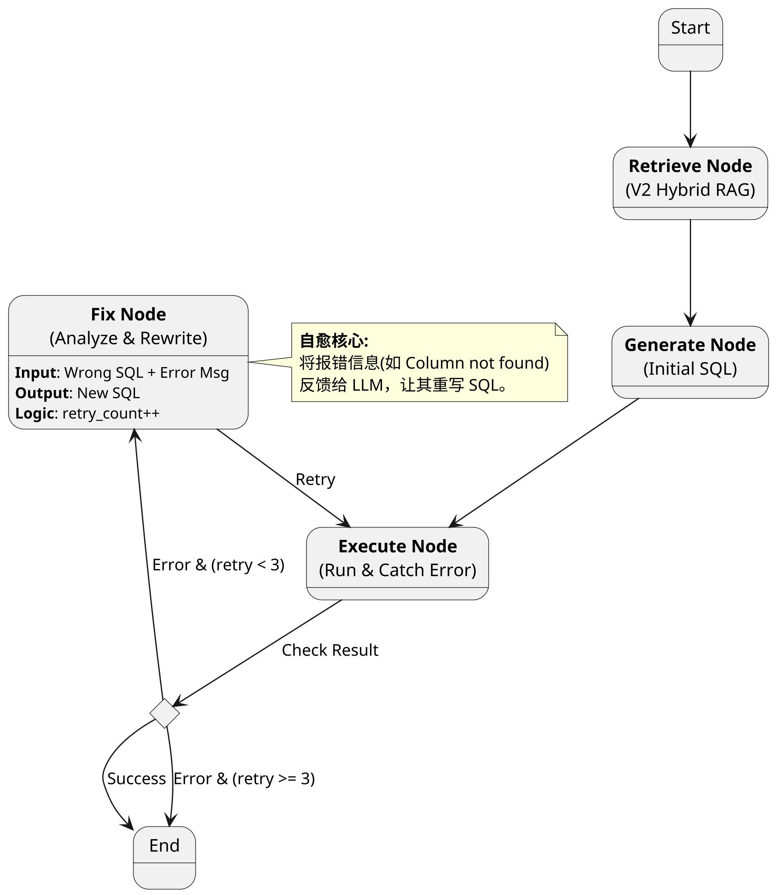
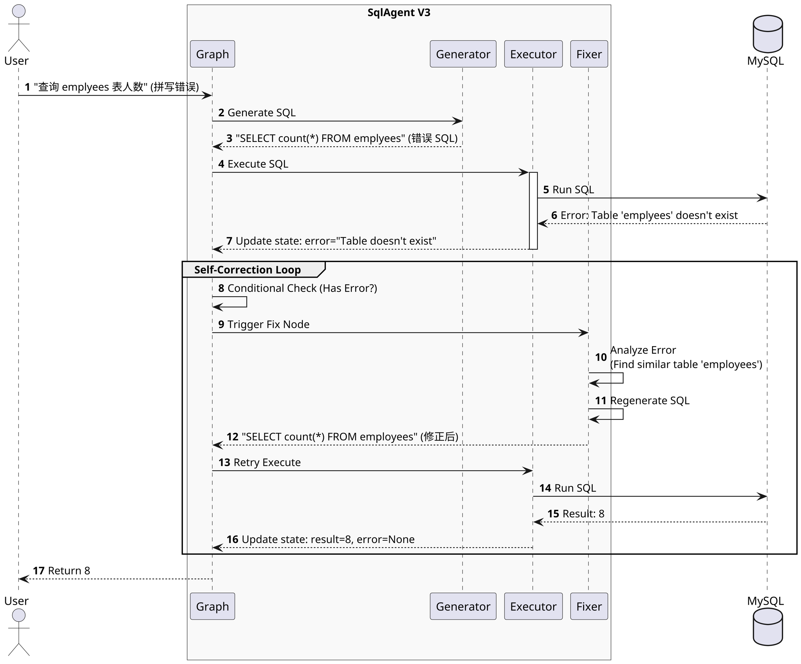

## 1. 设计目标 (Design Goal)

在 V2 实现高精度混合检索的基础上，**V3 版本 (Self-Correction)** 的核心目标是提升 Agent 的 **鲁棒性 (Robustness)** 和 **成功率 (Success Rate)**。

* **核心痛点**：V2 版本是单向线性流程。如果生成的 SQL 有语法错误（如字段拼写错误）或逻辑错误（如 Group By 缺失），执行节点会直接抛出异常，导致任务失败。
* **核心功能**：引入 **"Execute -> Evaluate -> Fix -> Retry"** 的闭环机制。当 SQL 执行失败时，Agent 能自动读取数据库的报错信息，分析原因并修正 SQL，直至执行成功或达到最大重试次数。
* **架构变更**：
    * 图结构从 DAG (有向无环图) 变为 **Cyclic Graph (有环图)**。
    * 引入 **SQL Validator** (基于 AST 的静态检查) 和 **Fix Node** (基于 LLM 的动态修复)。

## 2. 系统上下文 (System Context)

V3 在在线服务层引入了新的 **Loop (循环)** 机制。

<figure id="yunxingshi" class="fig">

<figcaption>图：系统上下文</figcaption>
</figure>

```plantuml
@startuml
!theme plain
left to right direction
skinparam dpi 300

actor "User" as User
component "SqlAgent Service" as App {
    component "Workflow Engine\n(LangGraph)" as Graph
    component "Hybrid Retriever\n(V2)" as Retriever
    component "SQL Validator\n(New)" as Validator
    component "Error Analyzer\n(New)" as Fixer
}

database "MySQL" as DB
cloud "Aliyun Qwen" as LLM

User --> App : Query
App --> Retriever : 1. Get Schema
Retriever --> LLM : 2. Generate SQL

group Self-Correction Loop
    LLM --> Validator : 3. Static Check (AST)
    Validator --> DB : 4. Execute
    DB --> Fixer : 5. Error Message (if fail)
    Fixer --> LLM : 6. Fix Instruction
    LLM --> Validator : 7. Regenerate SQL
end

App --> User : Result
@enduml

```

## 3. 核心状态定义 (Agent State Definition)

为了支持“重试”和“错误追踪”，State 需要新增错误上下文和计数器。

| 字段名 (Field) | 类型 (Type) | 描述 (Description) | 更新来源节点 | V3 新增 |
| --- | --- | --- | --- | --- |
| `user_query` | `str` | 用户原始问题 | Input | - |
| `retrieved_schemas` | `str` | RAG 检索到的 DDL | Retrieve Node | - |
| `generated_sql` | `str` | 当前生成的 SQL | Generate/Fix Node | - |
| `sql_result` | `List[Dict]` | 执行结果 | Execute Node | - |
| `error_message` | `str` | **最近一次执行的报错信息** | Execute Node | ✅ |
| `retry_count` | `int` | **当前重试次数** | Fix Node | ✅ |

## 4. 图结构拓扑 (Graph Topology)

这是 V3 最显著的变化。我们在 `Execute Node` 之后引入了 **Conditional Edge (条件边)**。

<figure id="tujiegou_v3" class="fig">

<figcaption>图：V3 自愈合循环流程</figcaption>
</figure>



## 5. 运行时序 (Runtime Sequence)

展示一次失败后修正成功的场景。

<figure id="yunxingshi" class="fig">

<figcaption>图：运行时序图</figcaption>
</figure>



## 6. 关键技术决策 (Key Decisions)

### 6.1 两级纠错策略 (Two-Level Correction)

* **Level 1: 静态语法检查 (AST Validation)**
* **工具**: 使用 `sqlglot` 库。
* **时机**: 在 SQL 生成后，执行前。
* **作用**: 检查基本的 SQL 语法错误（如括号不匹配、关键字拼写错误），无需连接数据库，速度快。
* *注: 由于 AST 解析无法校验表名是否存在（需要连库），所以只能作为第一道防线。*


* **Level 2: 运行时动态修复 (Runtime Reflection)**
* **工具**: LLM (Qwen)。
* **时机**: 数据库执行报错后。
* **Prompt**: `User Query: {query} \n Wrong SQL: {sql} \n Error: {error} \n Fix the SQL.`
* **作用**: 解决“表名/字段名不存在”、“Group By 逻辑错误”等运行时问题。


### 6.2 循环控制 (Loop Control)

* **决策**: 设定硬性 `MAX_RETRIES = 3`。
* **理由**: 防止 Agent 陷入死循环（如一直修不好，反复消耗 Token）。超过 3 次仍失败，则向用户抛出最终错误，并建议人工介入。

## 7. 接口定义 (API Interface)

保持接口不变，但在 Response 中增加 `trace` 信息（可选），告知用户 Agent 是否进行了自我修正。

**Response Update:**

```json
{
  "success": true,
  "data": {
    "sql": "SELECT ...",
    "result": [...],
    "trace": {
      "correction_occured": true,
      "retry_count": 1,
      "original_error": "Table 'emplyees' doesn't exist"
    }
  }
}

```

## 8. 开发计划 (Implementation Plan)

### Phase 3.1: 基础设施 (Infrastructure)

* [ ] 引入 `sqlglot` 依赖。
* [ ] 编写 `app/db/validator.py`: 实现 SQL 静态语法检查。

### Phase 3.2: 节点开发 (Node Development)

* [ ] 编写 `app/agent/nodes/fix.py`: 实现错误分析与重写逻辑。
* [ ] 改造 `app/agent/nodes/execute.py`: 捕获异常而不是直接抛出，将异常写入 State。

### Phase 3.3: 图编排 (Graph Orchestration)

* [ ] 改造 `app/agent/graph.py`:
* 引入 `Fix Node`。
* 添加 `should_continue` 条件边逻辑。
* 配置 Compile Checkpointer (为未来 Memory 做准备)。