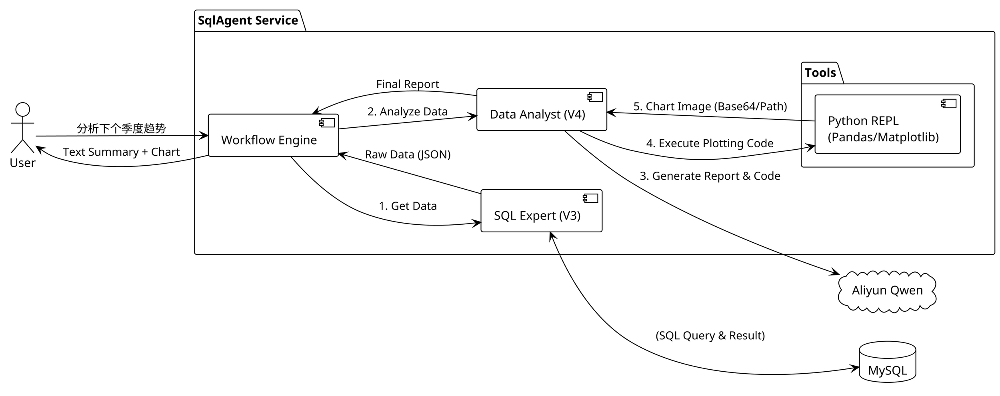
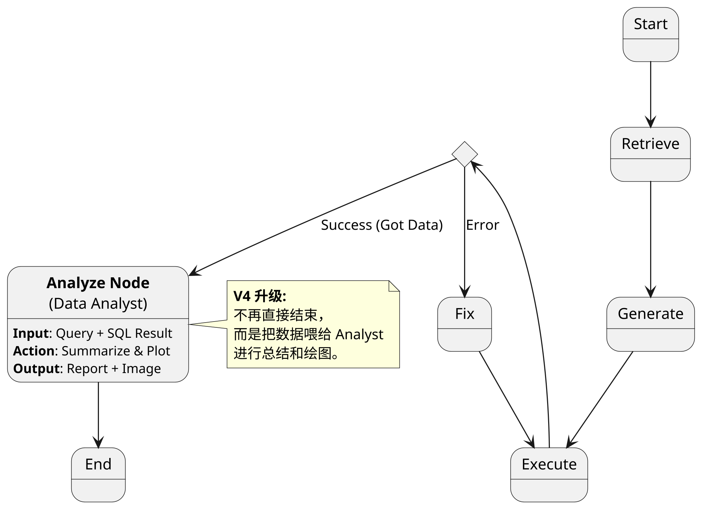
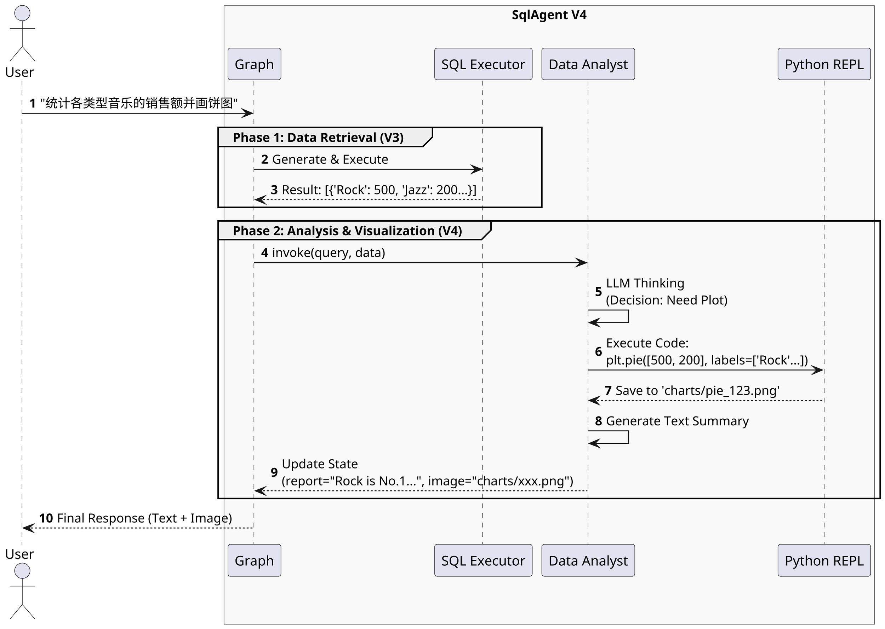

## 1. 设计目标 (Design Goal)

**V4 版本 (Smart Analyst)** 的核心目标是将 SqlAgent 从 "Text-to-SQL" 工具升级为 **"Text-to-Insight" (商业智能助手)**。

* **核心痛点**：V3 版本虽然能正确查询数据，但返回的是冰冷的 JSON 列表（如 `[{"revenue": 100}, {"revenue": 200}]`）。用户无法直观理解数据背后的趋势，也无法直接获得可视化图表。
* **核心功能**：
    * **数据洞察 (Insight)**：引入 **Analyze Node**，对 SQL 查询结果进行自然语言总结（如“销售额环比增长 20%”）。
    * **可视化 (Visualization)**：引入 **Python Tools** (Python REPL)，允许 Agent 编写并执行 Python 代码 (Pandas/Matplotlib) 生成图表。
* **架构变更**：
    * 图结构延长：在 `Execute Node` 之后增加 `Analyze Node`。
    * 引入工具集：集成 `langchain_experimental.utilities.PythonREPL`。

## 2. 系统上下文 (System Context)

V4 在流程末端引入了 **Code Interpreter (代码解释器)** 的能力。



## 3. 核心状态定义 (Agent State Definition)

State 需要存储分析结果和图表路径。

| 字段名 (Field) | 类型 (Type) | 描述 (Description) | 更新来源节点 | V4 新增 |
| --- | --- | --- | --- | --- |
| `user_query` | `str` | 用户原始问题 | Input | - |
| `sql_result` | `List[Dict]` | SQL 执行结果 (原始数据) | Execute Node | - |
| ... | ... | (V1-V3 其他字段) | ... | - |
| `analysis_report` | `str` | **自然语言分析报告** | Analyze Node | ✅ |
| `image_path` | `str` | **生成的图表文件路径** | Analyze Node | ✅ |

## 4. 图结构拓扑 (Graph Topology)

V4 是在 V3 的闭环之后，接了一个**线性的分析尾巴**。

<figure id="tujiegou_v4" class="fig">

<figcaption>图：V4 增加分析节点后的拓扑</figcaption>
</figure>



## 5. 运行时序 (Runtime Sequence)

展示一个“查询并画图”的完整流程。



## 6. 关键技术决策 (Key Decisions)

### 6.1 Python 执行环境 (Python REPL)

* **决策**：使用 `langchain_experimental.utilities.PythonREPL`。
* **理由**：
* 它是 LangChain 官方提供的轻量级代码执行器，支持 `print` 输出捕获。
* 相比于 E2B 等重型沙箱，PythonREPL 更适合本地开发和简单的绘图任务。
* **安全风险**：在生产环境需要容器化隔离（V5 解决），V4 阶段主要跑在本地环境。


### 6.2 绘图库选型

* **决策**：`Matplotlib` + `Seaborn`。
* **理由**：标准库，LLM 对其语法最熟悉，生成的代码成功率最高。图片保存为本地静态文件。

### 6.3 Prompt 策略 (Analyst Persona)

* **设计**：Analyst 拥有两个职责。
1. **Summarizer**: 如果数据量小或不需要画图，直接文字总结。
2. **Coder**: 如果用户明确要求画图，或者数据适合画图（如时间序列），生成 Python 代码。


## 7. 接口定义 (API Interface)

Response 结构再次升级，增加分析字段。

**POST /api/v1/chat**

```json
{
  "success": true,
  "data": {
    "sql": "SELECT ...",
    "result": [...],
    "analysis": "数据显示摇滚乐最受欢迎...", 
    "image_url": "http://localhost:8000/static/charts/pie_123.png" // 可选
  }
}

```

## 8. 开发计划 (Implementation Plan)

### Phase 4.1: 基础设施

* [ ] 安装依赖: `pandas`, `matplotlib`, `langchain-experimental`.
* [ ] 配置静态资源目录: `app/static/charts` 用于存放生成的图片。

### Phase 4.2: 工具开发

* [ ] 编写 `app/tools/chart.py`: 封装绘图工具函数，处理中文乱码问题（Matplotlib 经典坑）。

### Phase 4.3: 节点开发

* [ ] 编写 `app/agent/nodes/analyze.py`:
* 构建 Analyst Prompt。
* 逻辑：判断是否画图 -> 生成代码 -> 执行代码 -> 生成总结。


* [ ] 更新 `app/agent/graph.py`: 将 `Analyze Node` 接入 `Execute Node` 之后。

### 💡 准备工作

在你确认文档没问题后，我们需要先安装一下 V4 所需的“数据科学全家桶”。

请在终端执行：
```bash
# 安装 Pandas, Matplotlib 和 LangChain 的实验性工具库
pip install pandas matplotlib langchain-experimental
```